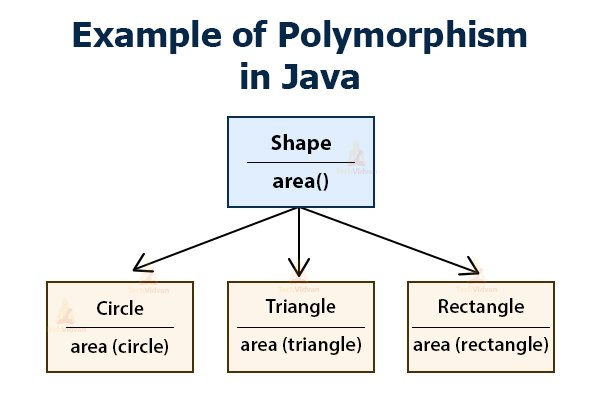

# Polymorphism
Polymorphism assignment from CompSci2

# Polymorphism

### Write the Java code for the following class hierarchy:

### Each Class should have an area() method for calculating that class' area.

# Formulas for calculating area:

### Circle: PI * r2
### Triangle: base * height / 2
### Rectangle: width * height

# Main Class

### In your main method, instantiate 3 Shape objects by calling the constructors for the three different subclasses of Shape. Then, print out and label the area for each separate object.

### What would the area method for the Shape class do? Can you find the area for a general shape? How?

# Abstract Class
### Make the Shape class abstract.
### Delete the body for the area() method and make it an abstract method.
### Now, any class that extends Shape must have an implementation for area() or that class must be declared abstract as well.
